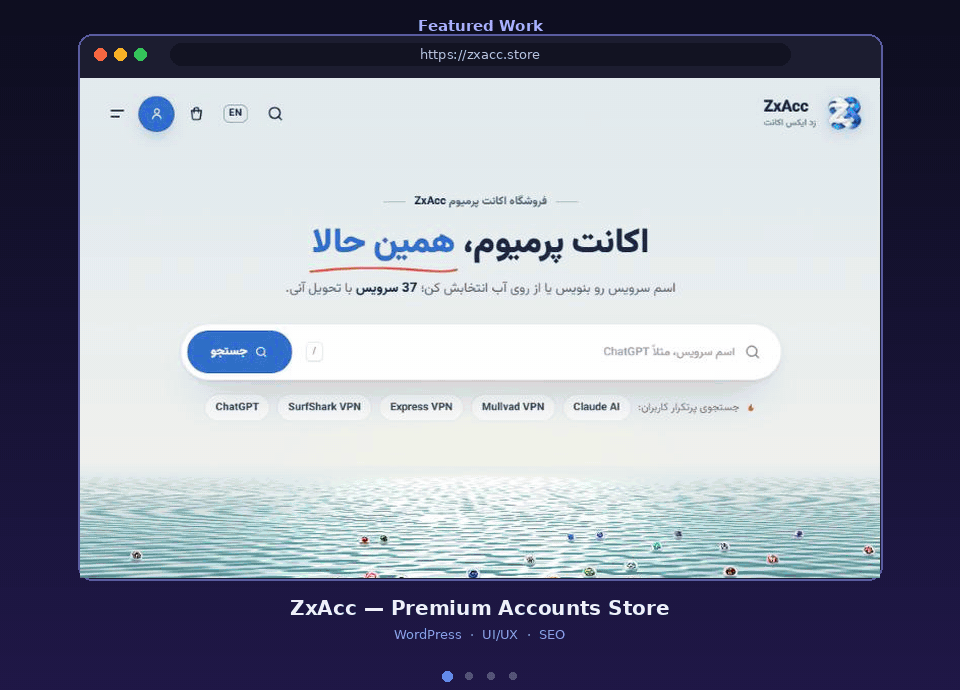

  

<h1 align="center">Hi, I'm ZERO 👋</h1>
<h3 align="center">UI/UX Designer · Web Developer · SEO Specialist · Telegram Mini App & Bot Developer</h3>

  

---

### 🧑‍💻 About Me

- 🎨 I design clean, user-friendly interfaces (**UI/UX**)
- 🌐 I build fast, responsive websites and web apps
- 🤖 I develop **Telegram Mini Apps** and **Telegram Bots**
- 📈 I optimize websites for search engines (**SEO**)
- 🧩 I build **WordPress** websites and custom **WordPress plugins**
- ☁️ I set up **Cloudflare** for speed, security & DNS
- 🎓 Certified Web Developer
- 📫 Open to freelance projects and collaborations

---

### 🛠 Tech Stack

**Design**

  
  

**Frontend**

  
  
  
  
  

**Backend & Bots**

  
  
  

**CMS, SEO & Tools**

  
  
  
  
  
  

---

### 🚀 What I Build

- 🤖 **Telegram Bots** — shop bots, support bots, automation & admin tools
- 📱 **Telegram Mini Apps** — web apps that run right inside Telegram
- 🌐 **Websites & Web Apps** — responsive, fast and SEO-friendly
- 🧩 **WordPress** — full websites, WooCommerce stores & custom plugins
- 🎨 **UI/UX Design** — wireframes, prototypes and polished interfaces

### 🖼 Featured Work

  

| Project | Type | Showcase | Live |
|---|---|---|---|
| **ZxAcc** | Premium accounts store | [📂 Repo](https://github.com/zeroux-dev/zxacc-store-showcase) | [🌐 zxacc.store](https://zxacc.store) |
| **Network Book** | Online bookstore | [📂 Repo](https://github.com/zeroux-dev/network-book-showcase) | [🌐 network-book.ir](https://network-book.ir) |
| **Nila Gallery** | Hair accessories shop | [📂 Repo](https://github.com/zeroux-dev/nila-gallery-showcase) | [🌐 nilagallery.ir](https://nilagallery.ir) |
| **Kharazi Tavos** | Sewing & craft supplies | [📂 Repo](https://github.com/zeroux-dev/kharazi-tavos-showcase) | [🌐 kharazitavos.com](https://kharazitavos.com) |

> Many client projects are private. Screenshots and live demos are available on request.

---

### 📊 GitHub Stats

  

---

### 📫 Contact

💬 Open to freelance projects — feel free to reach out!

  

  

